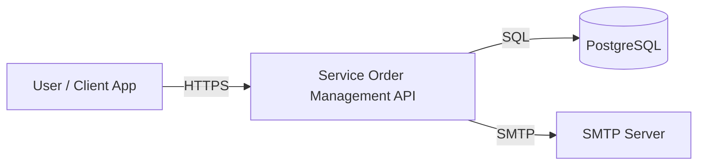
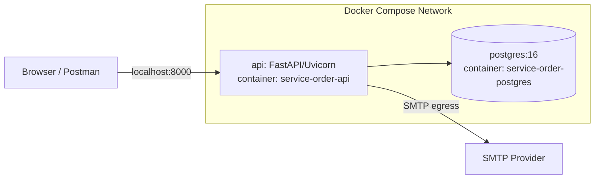
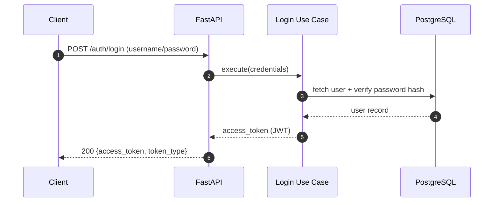
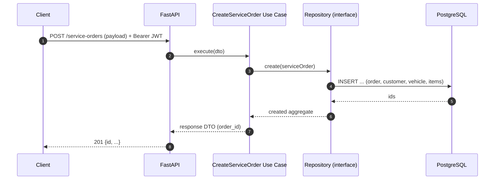
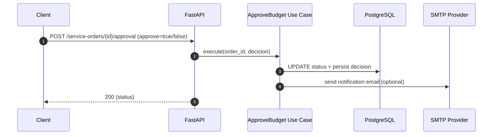
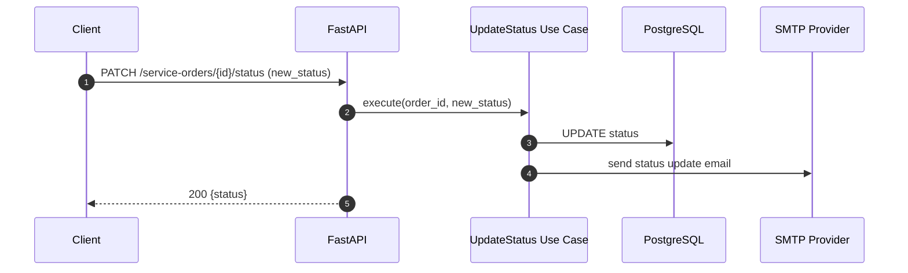

# Architecture

This document describes the system architecture, key flows, technology stack, and the rationale behind major technical choices for the Tech Challenge goals (quality, resilience, scalability).

## Goals & constraints (Tech Challenge)
- Maintainable codebase (Clean Architecture / Clean Code).
- Production-ready runtime (containerized, predictable startup, health checks).
- Resilience and scalability readiness (stateless API, clear boundaries, infra-friendly design).
- Automated tests for critical flows.

## Technology stack
### Runtime & API
- **Python 3.12**
- **FastAPI** (ASGI) + **Uvicorn**
- **Pydantic** for request/response validation and settings

### Persistence
- **PostgreSQL** (transactional relational store)
- **SQLAlchemy 2.x** (async) as ORM
- **Alembic** for schema migrations

### Security
- **JWT** (via `python-jose`) for authentication
- **bcrypt** hashing (via `passlib`)

### Messaging / notifications
- **SMTP** (async client) for email notifications

### Tooling & operations
- **Docker** + **Docker Compose** for local/prod parity
- **Poetry** for dependency management (also used inside the container image)
- **Pytest** for automated testing

## Architecture style
The project follows **Clean Architecture**: business rules in the center, frameworks and delivery mechanisms at the edges.

### Layers (code organization)
- `src/domain`: entities, value objects, enums, and contracts (repository/service interfaces).
- `src/application`: use cases (business workflows) and DTOs.
- `src/infrastructure`: implementations for persistence and external providers (DB, JWT, SMTP), plus settings.
- `src/presentation`: FastAPI routes, HTTP schemas, dependency wiring.

### Dependency rule
Dependencies point inward:
- `presentation` → `application` → `domain`
- `infrastructure` implements interfaces defined by `domain` / `application`

## System context

## Container view (Docker Compose)

Operational notes:
- The API is **stateless** (session state is not stored in memory), enabling horizontal scaling.
- Database is the system of record; schema is managed via Alembic.
- Health checks are exposed via `/health` (and container health check can probe the API).

## Main flows

### 1) Authentication (JWT login)

Why JWT:
- Works well with **stateless** APIs and reverse proxies/load balancers.
- Keeps authorization simple for REST clients (Postman/Swagger).

### 2) Open a service order (create OS)

Key rule: the use case orchestrates the workflow; persistence details stay in `infrastructure`.

### 3) Approve/reject budget (external approval)

### 4) Status update with notification

## Data model (high level)
Core concepts:
- **Customer**, **Vehicle**
- **ServiceOrder** (aggregate root)
- **ServiceItem**, **PartItem**
- Status workflow: `RECEIVED` → `DIAGNOSIS` → `WAITING_APPROVAL` → `IN_PROGRESS` → `FINISHED` → `DELIVERED`

## Scalability & resilience considerations
Current design choices that support scaling:
- Stateless API + JWT → can scale API replicas horizontally behind a load balancer.
- Clear layer boundaries → easier to evolve components independently.
- Database migrations are automated on container startup (with an option to run manually).

Expected next steps for full phase-2 infra (if required by the group):
- Kubernetes manifests (Deployment/Service/ConfigMap/Secret/HPA).
- Terraform for provisioning (cluster + database).
- CI/CD pipeline running tests + building/publishing images + deploying manifests.

## Why these technologies (rationale)
- **FastAPI**: strong typing + OpenAPI docs, high dev speed, async-friendly I/O for DB/SMTP.
- **PostgreSQL**: reliable transactional store, good for relational workshop data (orders, items, customers, vehicles).
- **SQLAlchemy + Alembic**: mature tooling; migrations keep schema evolution explicit and reviewable.
- **Clean Architecture**: supports long-term maintainability, testability, and controlled dependencies.
- **Docker Compose**: reproducible environment and “it runs with one command”, reducing operational risk for the project demo.

## API documentation
When running locally:
- Swagger UI: `http://localhost:8000/docs`
