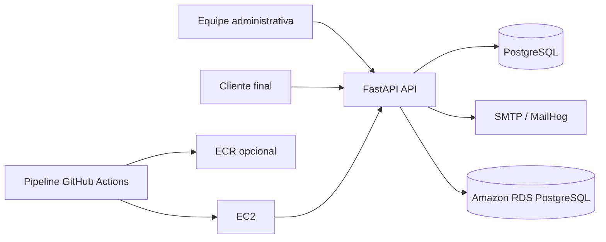
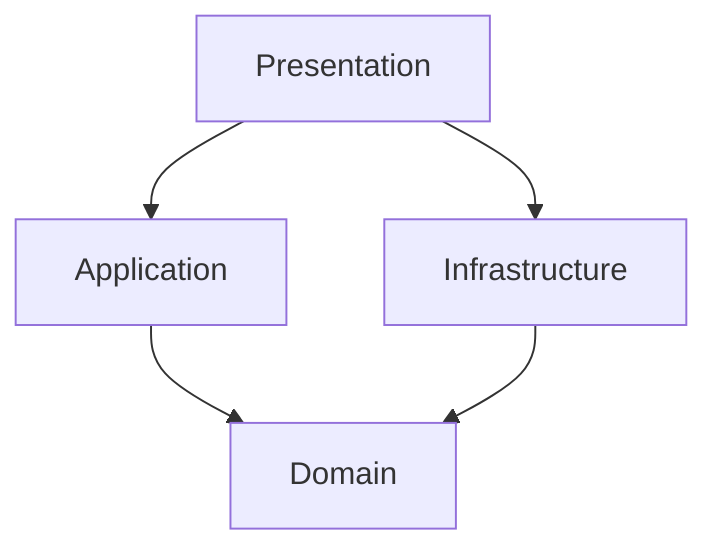
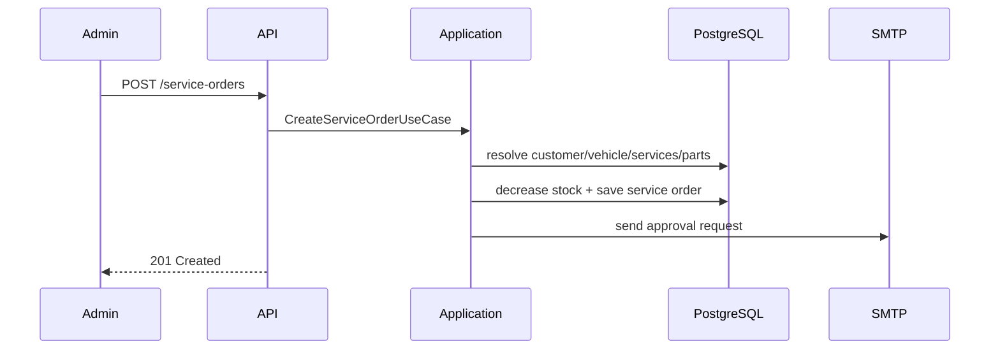

# Arquitetura da Solução

## Visão de contexto

O sistema atende três atores principais:

- equipe administrativa da oficina
- cliente final que aprova ou reprova o orçamento
- operações/DevOps que publicam e sustentam a aplicação

Integrações externas:

- PostgreSQL
- SMTP
- MailHog
- GitHub Actions
- AWS EC2/RDS/ECR

## Containers e blocos

- API FastAPI
- Banco PostgreSQL
- Serviço SMTP ou MailHog
- Pipeline CI/CD
- Infra AWS provisionada por Terraform



## Camadas internas

- `domain`
  - `ServiceOrder`, `Customer`, `Vehicle`, `CatalogService`, `InventoryPart`, `ServiceItem`, `PartItem`, `User`
- `application`
  - casos de uso de autenticação, CRUDs administrativos, criação e aprovação de OS, métricas
- `infrastructure`
  - repositórios PostgreSQL, SMTP, JWT, settings, logging
- `presentation`
  - rotas FastAPI, schemas, dependências e handlers



## Integrações externas

- Banco: `src/infrastructure/database`
- Email: `src/infrastructure/email`
- Migrations: `alembic/versions`
- Deploy local/prod: `docker-compose.yml`, `docker-compose.prod.yml`
- IaC: `infra/`
- Kubernetes opcional: `k8s/`

## Fluxo de criação da OS

1. Usuário autenticado chama `POST /service-orders`
2. O caso de uso resolve cliente e veículo
3. Consolida serviços e peças
4. Reduz estoque das peças referenciadas
5. Calcula orçamento da OS
6. Cria a OS em `WAITING_APPROVAL`
7. Gera tokens de aprovação/reprovação
8. Envia email ao cliente



## Fluxo de aprovação

1. Cliente recebe email com token
2. A decisão entra por `GET /public/service-orders/{id}/approval` ou `POST /public/service-orders/{id}/approval`
3. O token é validado
4. A OS muda para `IN_PROGRESS` ou volta para `DIAGNOSIS`
5. O cliente recebe atualização de status

## Fluxo de deploy

1. Pipeline valida lint, testes e cobertura
2. Build da imagem
3. Push opcional para registry
4. `workflow_dispatch` ou operador executa release na EC2
5. Serviço `migrate` aplica Alembic
6. API sobe e expõe `/health/ready`

## Fluxo de observabilidade

- logs em stdout com formato texto ou JSON
- `GET /health/live` para liveness
- `GET /health/ready` para prontidão com checagem de banco
- rotação de logs via driver `json-file` no Compose de produção

```mermaid
flowchart LR
    API[FastAPI] --> Logs[stdout estruturado]
    API --> Health[/health/live]
    API --> Ready[/health/ready]
    Logs --> Aggregator[CloudWatch ou agregador futuro]
```
